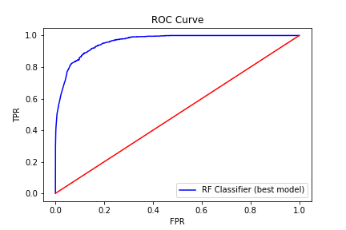

# The fraud detection app:

The aim of the program is to flag potential new fraud for further review as it comes in so it can be triaged by most pressing (and costly) transactions.

# How it works?

Given a JSON file with 137k transactions that are fraud or not, and other features, create a web based front-end with machine learning back end to enable quick triage of potential new fraud.

# Modeling + Evaluation

After EDA, having high dimensional training set with categorical, numerical and discret values, the app is based on the RandomForest Classifier. Once trained (GridSearched + CrossValidated) the model is stored using cPickle (the c version of Pickle allows a loading time < 3sec.) and reloaded and each GET/POST requests.

# Final performance of the model:

F1 score: 0.59, Precision: 0.93, Recall: 0.43, Accuracy: 0.95

# Web app features:

Registers service at POST /register.
Accepts input records on POST /score endpoint.
Gives triage label: low, medium, high risk.
Record predictions with attribute from the feature vectors in a postgresql db.
Host the app on AWS EC2.
